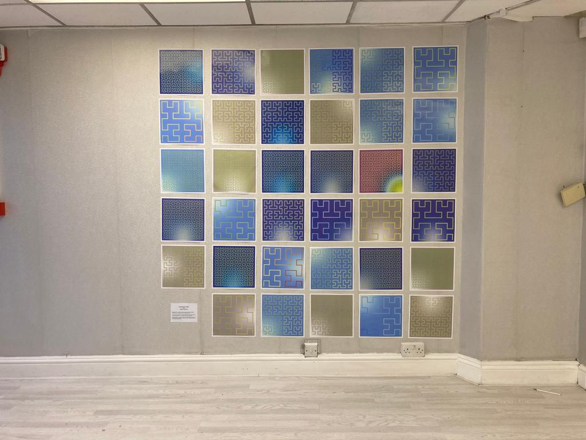

# DataSpaceArt
DataSpaceArt is a project for generating patterns with parameters which are altered by weather data. For this project, weather 
data from the Met Office DataHub API is used to change the parameters of the Hilbert curve, such as colour range for the curve,
length, background colour, etc.    

The aim of the project is to turn any type of quantitative data into a meaningful visual representation. With weather as
the choice of data, the goal is to generate a curve for each day of the month, using the daily weather data for Swansea. While the project has been created for use 
within Swansea in mind, the settings are completely configurable and work for any location in the world covered by Met Office's Site Specific forecast.

## Exhibition
DataSpaceArt will be displayed in a retail unit in the Swansea city centre! The exhibition showcases a collection of patterns
that were generated from July to December 2022 and capture a variety of unusual weather types, such as the hottest
recorded day of the year, coldest day of the year and a day where a lightning storm was captured in the data! If you want
a hint as to which one, it's the one that stands out the most...  

The exhibition lasts for a few weeks and can be found on Bellevue Way, just around the corner from The Dragon hotel.




## Usage 
Currently, the project has only been tested in Python 3.10.x, so it is recommended that you install this.  

To install the necessary dependencies, use `pip install -r requirements.txt` in your terminal.  

A [Met Office Weather DataHub](https://metoffice.apiconnect.ibmcloud.com/metoffice/production/) API key and secret is 
required as well. You can obtain these for free, but make sure to sign up for the site specific forecast API. Place these
under the appropriate settings in `config.json`, where you can also choose your preferences for the program.

Run `main.py`, and a Hilbert curve will be generated. Depending on your settings, it is then displayed and/or saved to 
the generated_figures directory.  

### Example:  

  

This example was generated using the following data:
```
SignificantWeatherCode: 7 (cloudy)
MaxTemperature: 21.0  # degrees C
MinTemperature: 12.69
WindSpeed: 4.94407158836689  # mph
WindDirection: 146  # bearing
...
```
Some unused data is omitted, and plans to implement it are being considered in future updates.  

## How it works  
Data comes from a Met Office DataHub API request, returning an JSON containing an extensive
amount of useful weather data for a given set of latitude and longitude coordinates. The code for this is adapted from
one of my other projects, [weather-cli](https://github.com/corndogit/weather-cli).  

Coordinates for a 2-dimensional Hilbert curve, which is a type of space-filling curve, are generated by 
[hilbertcurve](https://github.com/galtay/hilbertcurve) and are plotted using matplotlib with the order determined by some data from 
the input. The data is also used to generate colour ranges using [colour.py](https://github.com/vaab/colour) 
to apply along the length of the curve and the background. The current uses of the data are as follows:
- Wind speed (in mph) determines the number of iterations used to generate a Hilbert curve (between 3 and 8).
- Wind direction determines where the radial background gradient starts from.
- The weather type corresponds to a dictionary of hex colour tuples, used to generate a colormap for the background.
- Min/Max temperature in Celsius determine the start and end point colour along the Hilbert curve.   

## Future changes
- [ ] Come up with ways to change the output using currently unused data (e.g. chance of rainfall, relative humidity, visibility)
- [ ] Implement "special events" for rare weather events
- [ ] Plan how to take the output from the program and display it (e.g. on a webpage)
- [ ] Write a Twitter bot that posts a generated pattern once per day
